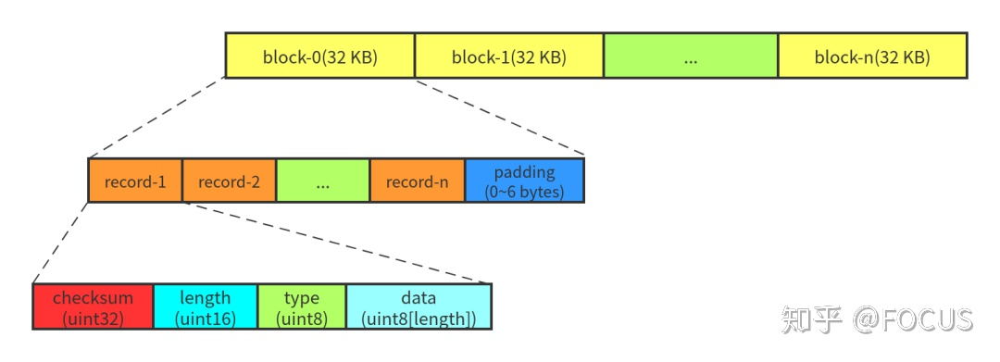
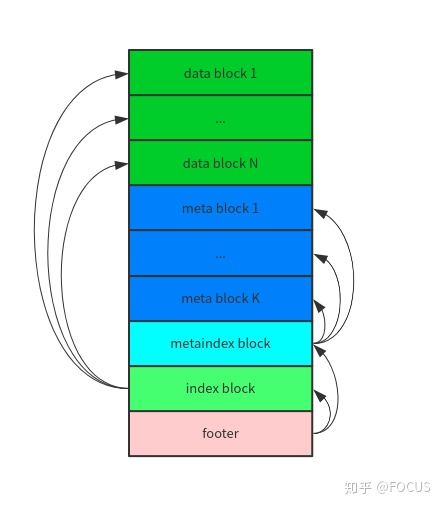
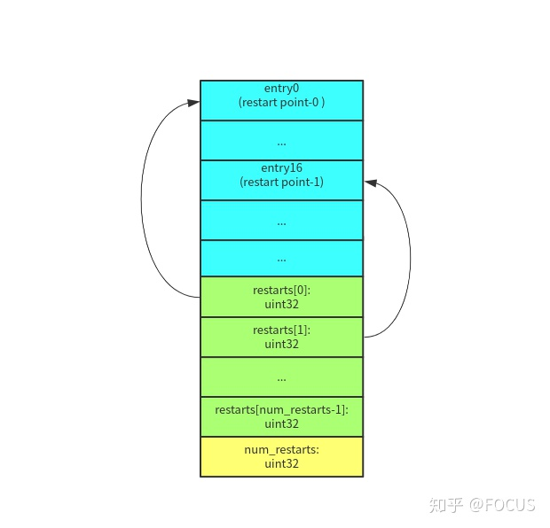

### 基础:
> **user_key:** 用户输入的关键字, string  
  **internal_key:** 程序内部使用的关键字  
> | user_key | (sequenceNumber << 8) \| ValueType |
> | :------: | :-----------------------------: |
> |          | 固定长度8bytes |
>
> **memtable_key** 在**MemTable**上使用的关键字
> | klength | internal_key |
> | :-----: | :----------: |
> | internal_key的长度 | |

### 文件:
* #### .log
> **作用:** WAL(write ahead logging)日志文件. 与MemTable一一对应  
  **内容结构:**  
  , 其中data的结构是
> ```
> data :=
>    sequence: fixed64
>    count: fixed32
>    data: record[count]
> record :=
>    kTypeValue varstring   |
>    kTypeDeletion
> varstring :=
>    len: varint32
>    data: uint8[len]
> ```
> **其他:** 文件名格式为"6位编号.log", 例如000003.log. 其编号从3开始

* #### .sst | .ldb
> **作用:** .sst为旧版本. 本质上都是SSTable(Sorted String Table), 数据库的外存文件  
  **内容结构:**
> * *文件结构:*  
    
  文件中block是变长的, 每个block后面都有一个trailer(CompressType + crc, 5 bytes).   
  data_block, meta_index_block, index_block采用前缀压缩

> * *block结构:*  
    
    其中  
>> * entry: block中的key-value称为entry
>> * restarts: 默认每16个key就会重新计算前缀压缩，并将该key称之为重启点(restart point, 包含起始key). restarts数组记录了这个block中所有重启点的offset
>> * num_restarts：是restarts数组的长度  

>  * *entry结构:* 
    
  各字段含义
>> * shared_bytes：和前一个 key 相同的前缀长度。
>> * unshared_bytes：和前一个 key不同的后缀部分的长度。
>> * value_length：value 数据的长度。
>> * key_delta：和前一个 key不同的后缀部分。
>> * value：value 数据

> * *footer结构:*  
>> 固定大小48bytes. 内容是一个8字节的magic number和2个BlockHandle---指向index_block和meta_block

> **其他:** 
>> * data_block中的key是internal_key 
>> * index_block中的entry指向data_block, 它的key是大于指向data_block的最大key, 但小于下一个data_block的key的最小值
>> * meta_block只会有一个, 所以meta_index_block中只有一条entry. 文件名为"6位编号.sst | .ldb"
>> * level0中文件key可能存在交叉, 而其它每一层内文件, 则key不存在相交, 且按key值范围进行排序, 所以在非0层上可以进行二分查找

* #### MANIFEST
> **作用:** 保存整个数据库的元信息, 格式类似于日志文件, ,每条记录是VersionEdit  
  **其他:** 程序只会有一个MANIFEST文件, 旧的会被删除. 文件名为"MANIFEST-6位编号", 例如MANIFEST-000002

* #### CURRENT
> **作用:** 记录当前MANIFEST的文件名  
  **其他:** 有且只有一个CURRENT文件, 其内容为一般字符串

* #### LOCK
> **作用:** 文件锁, 确保数据库只被一个进程控制

* #### LOG & LOG.old
> **作用:** 与.log不同, 记录的是数据库运行时信息, 而不是用户数据  
  **其他:** 每次启动, 如果用户没有指定特定文件, 则默认使用目录下LOG文件. 若LOG文件已存在, 则将其改名为LOG.old, 然后新建名为LOG的文件. 其内容一般字符串, 可人为识别


